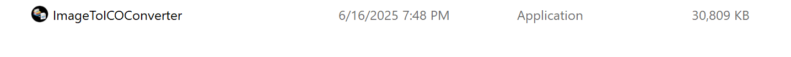
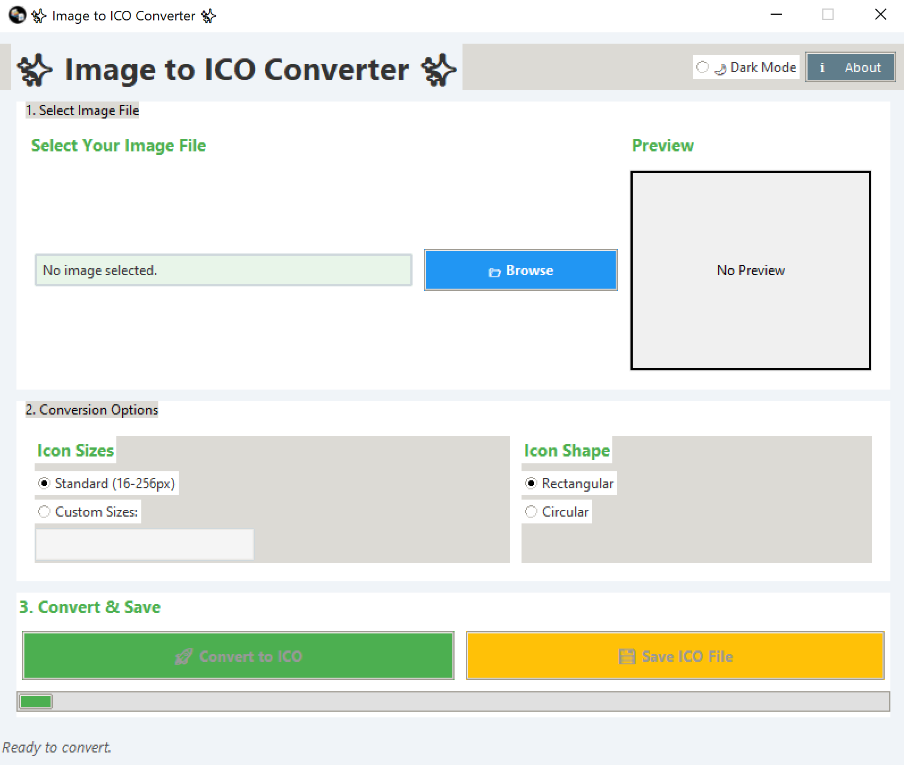
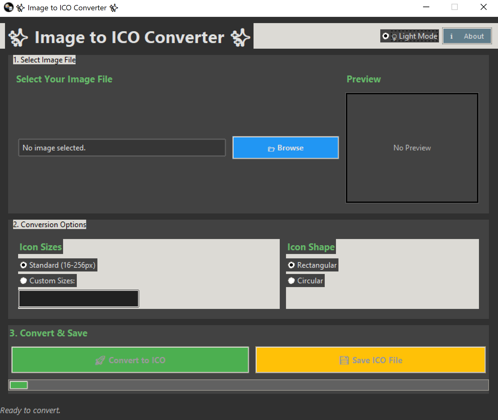
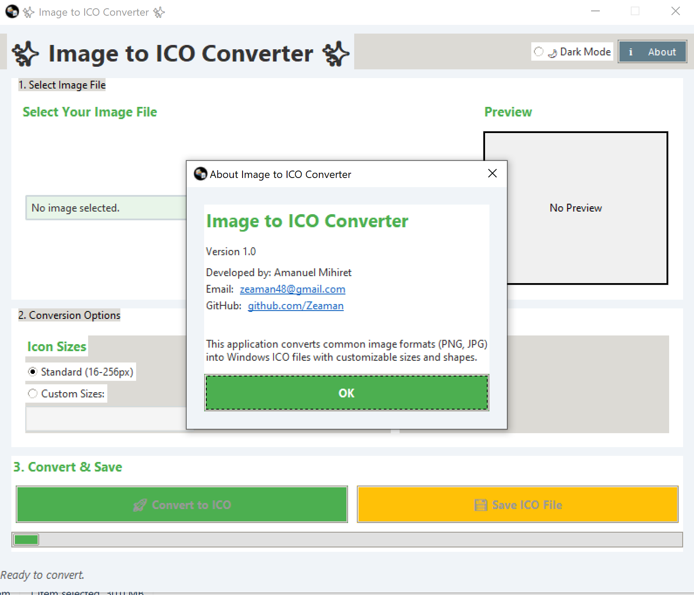
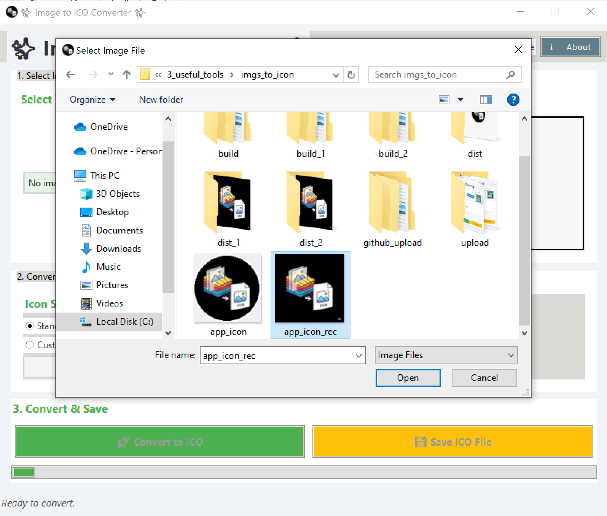
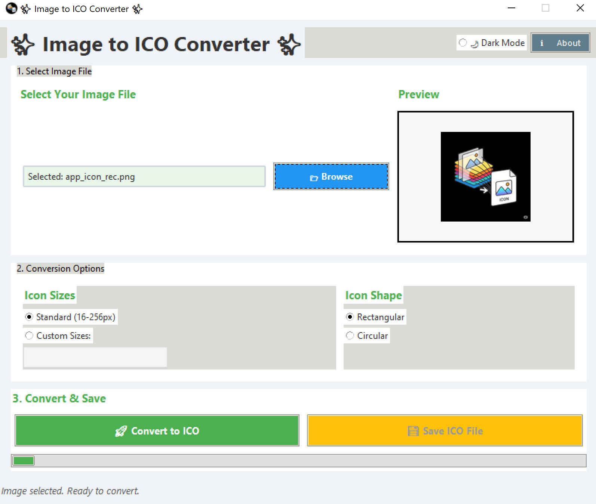
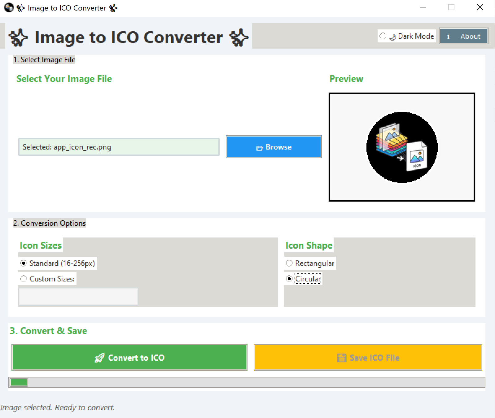
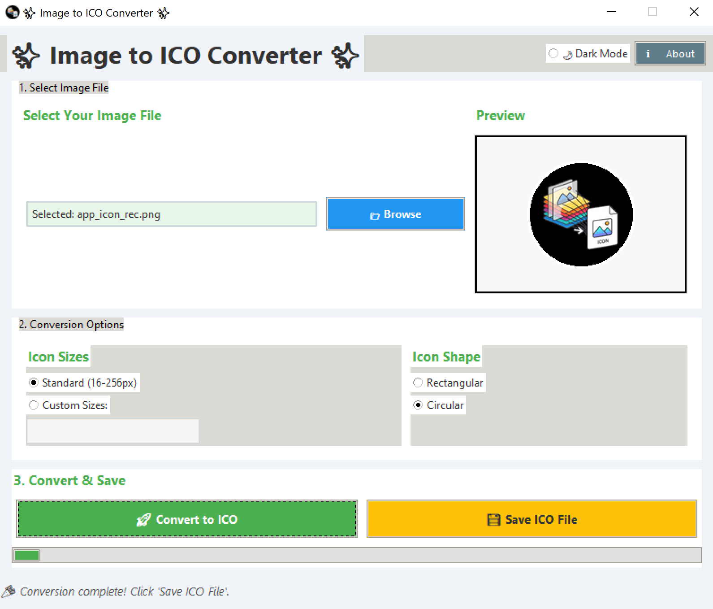
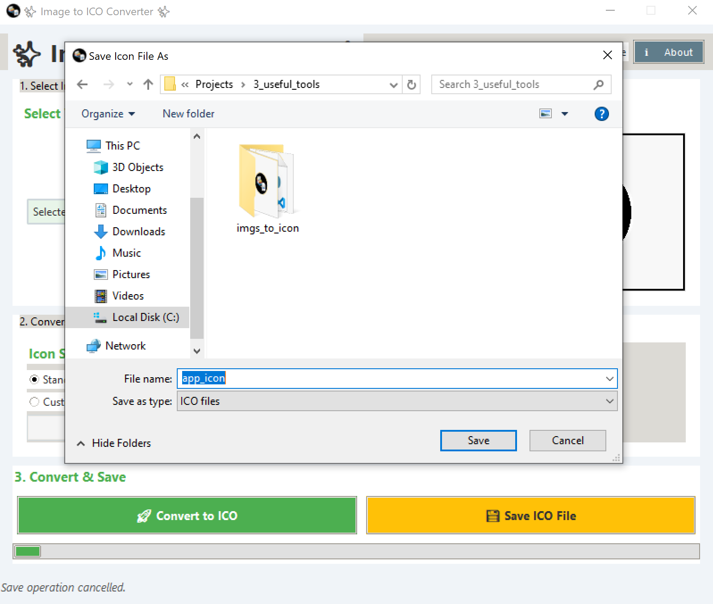
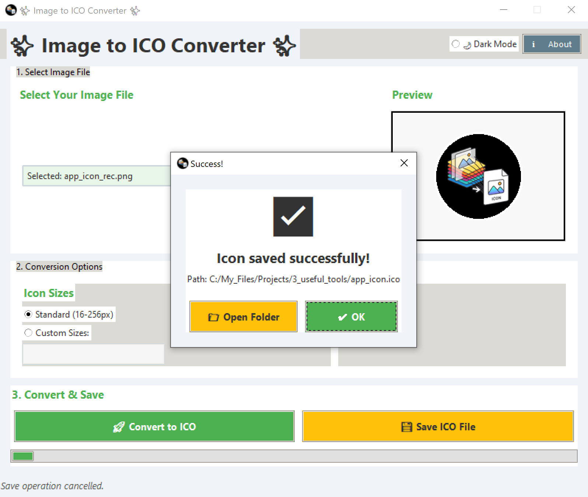

# Image-to-ICO-Converter-GUI

Here's a comprehensive `README.md` file and `requirements.txt` for your Image to ICO Converter project:

---

# 🖼️ Image to ICO Converter

A professional desktop application that converts standard image files (PNG, JPG) to Windows ICO format with customizable sizes and shapes.

## ✨ Features

- **Multiple Size Options**:
  - Standard sizes (16x16 to 256x256)
  - Custom size configurations
- **Shape Customization**:
  - Rectangular or circular icons
  - Automatic circular mask with white border
- **Modern UI**:
  - Light/dark mode toggle
  - Responsive layout
  - Interactive preview
- **Efficient Processing**:
  - Background thread conversion
  - Progress indication
- **Professional Output**:
  - Multi-resolution ICO support
  - Transparent backgrounds

## 🚀 Quick Start

### Requirements
- Python 3.8+
- Windows (for best ICO compatibility)

### Installation
1. Clone the repository:
   ```bash
   git clone https://github.com/yourusername/image-to-ico-converter.git
   cd image-to-ico-converter
   ```

2. Install dependencies:
   ```bash
   pip install -r requirements.txt
   ```

3. Run the application:
   ```bash
   python icon_converter.py
   ```

## 🛠️ Building the Executable

To create a standalone Windows executable:

```bash
pip install pyinstaller
pyinstaller --onefile --windowed --icon=app_icon.ico icon_converter.py
```

The executable will be in the `dist` folder.

## 🖌️ Usage Guide

1. **Select Image**: Click "Browse" to choose your source image
2. **Set Options**:
   - Choose standard or custom sizes
   - Select a rectangular or circular shape
3. **Convert**: Click "Convert to ICO"
4. **Save**: Click "Save ICO File" to save your new icon

## 📂 File Structure

```
image-to-ico-converter/
├── converter.py                # Main application code
├── requirements.txt            # Python dependencies
├── ImageToICOConverter.spec    # .spec file for building the EXE
├── app_icon.ico                # Application icon (ICO format)
├── app_icon.png                # Application icon (PNG format)
├── README.md                   # This file
└── saved_icons/                # Default output folder
```

## 📝 Requirements

The application requires the following Python packages (automatically installed with `requirements.txt`):

```text
Pillow>=9.3.0
pyperclip>=1.8.2
```

## 🌟 Features in Detail

### Image Processing
- Supports PNG, JPG, JPEG input formats
- Automatic alpha channel handling
- High-quality resizing with Lanczos filtering
- Circular icon generation with anti-aliased edges

### UI Features
- Real-time preview of source image
- Dark/light mode toggle
- Progress bar during conversion
- Detailed status messages
- Modern, responsive layout

## Demo-time

1. app



2. User interface (HOME)





3. About-page



4. Upload image



5. Preview





6. Size Customization


   
7. Converted ICO



8.  Save






## 🐛 Troubleshooting

**Problem:** Image preview not showing  
**Solution:** Ensure you're using supported image formats (PNG, JPG)

**Problem:** Circular icons have jagged edges  
**Solution:** Use higher resolution source images (minimum 256x256 recommended)

**Problem:** ICO files not recognized  
**Solution:** Try including standard sizes (16, 32, 48 pixels) in your conversion

## 🤝 Contributing

Contributions are welcome! Please:
1. Fork the repository
2. Create a feature branch
3. Submit a pull request

## 📜 License

MIT License - See [LICENSE](LICENSE) for details.

---

Developed with ❤️ by [Your Name]  
📧 Contact: zeaman48@gmail.com  
🌐 YT-Portfolio: https://www.youtube.com/@YomTech44
```

---

# `requirements.txt`

```text
Pillow>=9.3.0
pyperclip>=1.8.2
```

### Key Notes:

1. **Minimal Dependencies**: Only includes essential packages to keep the application lightweight
2. **Version Pinning**: Uses `>=` for flexibility while ensuring minimum working versions
3. **Tkinter Not Listed**: Not included as it's part of Python's standard library on Windows
4. **PyInstaller Optional**: Only needed for building executables, not for running the app
